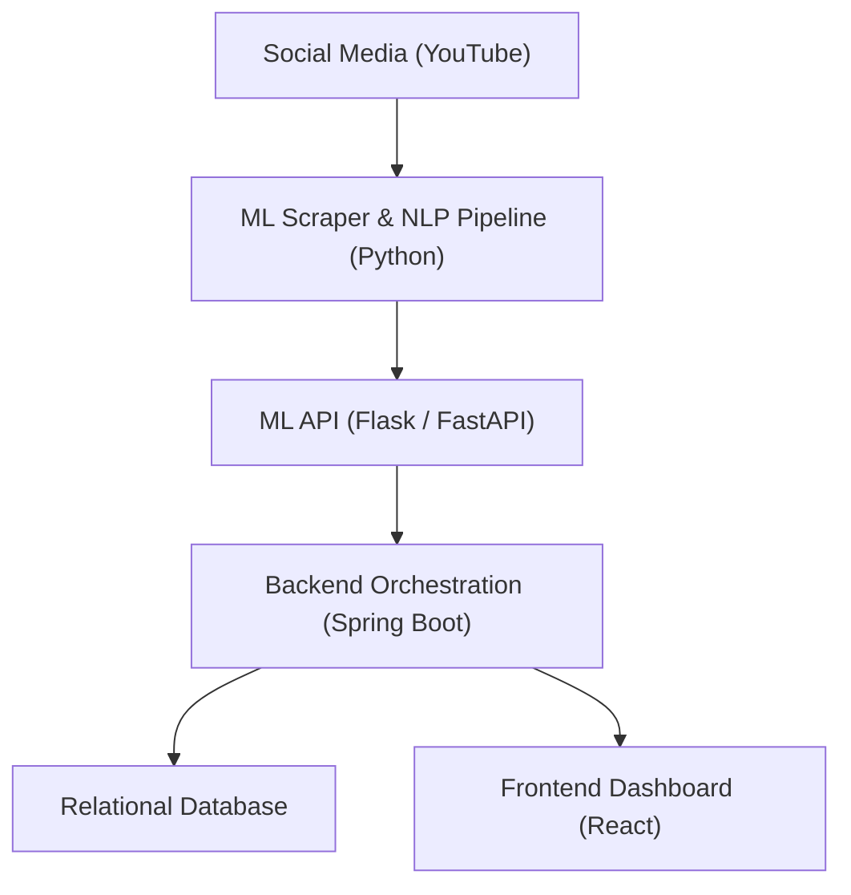

# 🌊 Ocean Hazard Intelligence Platform  
**Ocean Hazard Detection using Social Media Analytics**

A full-stack, machine-learning–powered platform that detects **early signs of ocean-related hazards** by analyzing public conversations on social media. The system converts unstructured social media data into actionable insights for coastal authorities using **ML classification, sentiment analysis, automated backend pipelines, and a real-time dashboard**.

---

## 📌 Project Overview

Conventional ocean hazard monitoring relies on sensors, buoys, and satellites, which may not always capture **real-time public experiences** during rapidly evolving events. Meanwhile, people actively share observations, alerts, and concerns on social media.

This project bridges that gap by:
- Mining social media conversations (YouTube)
- Applying **Machine Learning & NLP**
- Automating analysis pipelines
- Presenting insights through a secure dashboard

The result is an **early-warning decision support system** that complements traditional monitoring approaches.

---

## 🎯 Objectives

- Detect **hazard-related social media posts** using ML
- Perform **sentiment analysis** to gauge public concern
- Extract **trending hazard-related keywords**
- Automate scraping, processing, and storage
- Provide a **secure, visual dashboard** for authorities
- Demonstrate social media as a **supplementary early-warning signal**

---

## 🧠 High-Level Architecture

---

## 📂 Repository Structure
```bash
ocean-hazard-intelligence-platform/
│
├── backend/                # Spring Boot backend services
│   ├── src/
│   ├── gradle/
│   ├── build.gradle.kts
│   ├── settings.gradle.kts
│   └── README.md
│
├── frontend/               # React-based authority dashboard
│   ├── src/
│   ├── public/
│   ├── package.json
│   ├── package-lock.json
│   └── README.md
│
├── ml/                     # Machine Learning & NLP pipeline
│   ├── data/
│   ├── models/
│   ├── src/
│   ├── requirements.txt
│   └── README.md
│
├── .gitignore
└── README.md               # 📌 You are here (root documentation)
```

---


Each module is **independently structured, documented, and deployable**.

---

## 🧩 Module Details

### 🔹 Machine Learning Module (`/ml`)
- Scrapes YouTube comments related to ocean conditions
- Cleans and preprocesses text data
- Classifies posts as **Hazard / Non-Hazard**
- Performs **sentiment analysis**
- Extracts **trending keywords**
- Exposes an API for backend integration

**Technologies:** Python, scikit-learn, NLP, Flask/FastAPI

---

### 🔹 Backend Module (`/backend`)
- Built with **Spring Boot**
- Schedules automated scraping & analysis jobs
- Calls the ML API and processes predictions
- Stores structured results in a relational database
- Handles authentication and security
- Acts as the central orchestration layer

**Technologies:** Java, Spring Boot, JWT, Gradle

---

### 🔹 Frontend Module (`/frontend`)
- Interactive **authority dashboard**
- Displays:
  - Hazard alerts
  - Sentiment distribution
  - Keyword trends
  - Recent reports
- Secure login and responsive UI

**Technologies:** React.js, JavaScript, HTML, CSS

---

## 🛠️ Requirements

### Hardware
- CPU: Intel i5 or higher
- RAM: Minimum 8 GB (16 GB recommended)
- Storage: 10–20 GB

### Software
- Python 3.9+
- Java JDK 17+
- Node.js & npm
- MySQL / PostgreSQL
- Tools: VS Code, IntelliJ IDEA, Postman

---

## 🚀 How to Run (Local Setup)

> Refer to individual module READMEs for detailed instructions.

### 1️⃣ Run ML API
```bash
cd ml
pip install -r requirements.txt
python src/api.py
```

### 2️⃣ Run Backend
```bash
cd backend
./gradlew bootRun
```

### 3️⃣ Run Frontend
```bash
cd frontend
npm install
npm start
```

---

## 📊 Key Features

- ✔ Real-time hazard detection from social media  
- ✔ ML-based classification and sentiment analysis  
- ✔ Automated backend scheduling  
- ✔ Secure, role-based dashboard  
- ✔ Modular and scalable system architecture  

---

## 🔮 Future Scope

- Multi-platform integration (Twitter, Instagram, news feeds)  
- Geo-tagged hazard visualization  
- Crowdsourced citizen reporting  
- Deep learning–based forecasting (BERT / Transformers)  
- Multilingual NLP support  
- Cloud deployment (AWS / Azure)  

---
